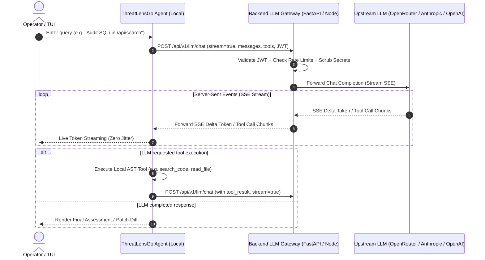

# ThreatLens Backend LLM Gateway Specification

**Document Version:** `1.0.0`  
**Status:** `Approved & Ready for Implementation`  
**Target Architecture:** FastAPI / Node.js Backend Gateway + ThreatLensGo TUI Agent

---

## 1. Overview & Objectives

In the current direct architecture, the TUI agent makes outbound requests directly from the client machine to third-party LLM providers (e.g., OpenRouter, OpenAI, Anthropic). 

Transitioning to a **Backend LLM Gateway** shifts responsibility to the backend, achieving:
1. **Zero Secret Exposure:** Upstream API keys (`OPENROUTER_API_KEY`, `OPENAI_API_KEY`, etc.) remain secured on the backend server. The TUI only provides its user session/JWT token.
2. **Centralized Rate Limiting & Token Budgeting:** Enforce token limits, prevent runaway loops, and manage costs centrally across all operators.
3. **Auditing & Compliance:** Log all prompts, tool invocations, and agent actions for security audit trails without exposing sensitive operator workspace secrets.
4. **Resilient Provider Routing & Fallback:** Seamlessly route requests to backup models (e.g., Claude 3.5 Sonnet → GPT-4o → Local Ollama) if an upstream provider experiences downtime or rate limits.
5. **Prompt Injection & Data Sanitization:** Scrub sensitive secrets (e.g., `.env` credentials, private keys) before prompts leave the organization boundary.

---

## 2. High-Level Architecture Flow



---

## 3. Authentication & Common Headers

All requests from the TUI to the Backend Gateway MUST include standard authentication and telemetry headers:

| Header | Type | Required | Description |
| :--- | :--- | :--- | :--- |
| `Authorization` | `string` | **Yes** | `Bearer <JWT_TOKEN_OR_SESSION_KEY>` |
| `Content-Type` | `string` | **Yes** | `application/json` |
| `X-Session-ID` | `string` | Optional | Unique session identifier for conversation grouping |
| `X-Workspace-ID` | `string` | Optional | Target workspace identifier for security isolation |
| `X-Client-Version`| `string` | Optional | E.g., `ThreatLensGo/0.1.0` |

---

## 4. API Endpoint Requirements

### Endpoint 1: Chat Completion with Streaming (`POST /api/v1/llm/chat`)

The core endpoint used by the autonomous agent loop for both token streaming and multi-turn tool calling.

- **Method:** `POST`
- **Path:** `/api/v1/llm/chat`
- **Content-Type:** `application/json`
- **Accept:** `text/event-stream` (when `stream: true`) or `application/json` (when `stream: false`)

#### 4.1. Request Schema

```json
{
  "model": "anthropic/claude-3.5-sonnet",
  "messages": [
    {
      "role": "system",
      "content": "You are ThreatLens Autonomous Agent..."
    },
    {
      "role": "user",
      "content": "Find all API routes vulnerable to SQL injection."
    },
    {
      "role": "assistant",
      "content": null,
      "tool_calls": [
        {
          "id": "call_1_0",
          "type": "function",
          "function": {
            "name": "search_code",
            "arguments": "{\"query\":\"SELECT * FROM\"}"
          }
        }
      ]
    },
    {
      "role": "tool",
      "tool_call_id": "call_1_0",
      "content": "{\"matches\":[{\"file\":\"db/user.py\",\"line\":42}]}"
    }
  ],
  "tools": [
    {
      "type": "function",
      "function": {
        "name": "search_code",
        "description": "Fast regex search across codebase files",
        "parameters": {
          "type": "object",
          "properties": {
            "query": { "type": "string", "description": "Search pattern" }
          },
          "required": ["query"]
        }
      }
    }
  ],
  "temperature": 0.2,
  "max_tokens": 4096,
  "stream": true
}
```

#### 4.2. Request Fields

| Field | Type | Required | Default | Description |
| :--- | :--- | :--- | :--- | :--- |
| `model` | `string` | No | Server Default | Requested model ID. If omitted, backend uses configured default. |
| `messages` | `Array<LLMMessage>` | **Yes** | — | Ordered conversation history. |
| `tools` | `Array<ToolDef>` | No | `[]` | Available local tool definitions in OpenAI Function calling format. |
| `temperature` | `number` | No | `0.2` | Sampling temperature (0.0 to 1.0). Deterministic 0.2 recommended for code analysis. |
| `max_tokens` | `integer` | No | `4096` | Maximum generation tokens. |
| `stream` | `boolean` | No | `true` | When `true`, returns Server-Sent Events (`text/event-stream`). |

---

#### 4.3. Streaming Response Format (`stream: true`)

The response MUST return `Content-Type: text/event-stream; charset=utf-8` using the standard OpenAI-compatible SSE format with delta chunks:

```http
HTTP/1.1 200 OK
Content-Type: text/event-stream
Cache-Control: no-cache
Connection: keep-alive
X-Accel-Buffering: no

data: {"id":"chatcmpl-123","choices":[{"index":0,"delta":{"role":"assistant","content":"I will"},"finish_reason":null}]}

data: {"id":"chatcmpl-123","choices":[{"index":0,"delta":{"content":" search the codebase."},"finish_reason":null}]}

data: {"id":"chatcmpl-123","choices":[{"index":0,"delta":{"tool_calls":[{"index":0,"id":"call_abc","function":{"name":"search_code","arguments":"{\"query\":\""}}]}}]}

data: {"id":"chatcmpl-123","choices":[{"index":0,"delta":{"tool_calls":[{"index":0,"function":{"arguments":"SELECT * FROM\"}"}}]}}]}

data: {"id":"chatcmpl-123","choices":[{"index":0,"delta":{},"finish_reason":"tool_calls"}]}

data: [DONE]
```

---

#### 4.4. Non-Streaming Response Format (`stream: false`)

```http
HTTP/1.1 200 OK
Content-Type: application/json

{
  "id": "chatcmpl-123",
  "model": "anthropic/claude-3.5-sonnet",
  "choices": [
    {
      "index": 0,
      "message": {
        "role": "assistant",
        "content": "Found 1 vulnerable SQL statement.",
        "tool_calls": [
          {
            "id": "call_abc",
            "type": "function",
            "function": {
              "name": "edit_file",
              "arguments": "{\"path\":\"db/user.py\",\"replacement\":\"...\"}"
            }
          }
        ]
      },
      "finish_reason": "tool_calls"
    }
  ],
  "usage": {
    "prompt_tokens": 1240,
    "completion_tokens": 85,
    "total_tokens": 1325
  }
}
```

---

### Endpoint 2: List Available Models (`GET /api/v1/llm/models`)

Allows the TUI / CLI to discover which models are currently enabled, their capabilities, and current status.

- **Method:** `GET`
- **Path:** `/api/v1/llm/models`
- **Response:**

```json
{
  "default": "anthropic/claude-3.5-sonnet",
  "models": [
    {
      "id": "anthropic/claude-3.5-sonnet",
      "name": "Claude 3.5 Sonnet",
      "provider": "Anthropic",
      "context_window": 200000,
      "supports_tools": true,
      "status": "healthy"
    },
    {
      "id": "openai/gpt-4o",
      "name": "GPT-4o",
      "provider": "OpenAI",
      "context_window": 128000,
      "supports_tools": true,
      "status": "healthy"
    },
    {
      "id": "nvidia/nemotron-3.5-lightning:free",
      "name": "Nemotron 3.5 (Free Tier)",
      "provider": "OpenRouter",
      "context_window": 32768,
      "supports_tools": true,
      "status": "healthy"
    }
  ]
}
```

---

### Endpoint 3: Gateway Health & Quota (`GET /api/v1/llm/health`)

Used on TUI startup to verify gateway connectivity and display operator quotas.

- **Method:** `GET`
- **Path:** `/api/v1/llm/health`
- **Response:**

```json
{
  "status": "online",
  "version": "1.0.0",
  "upstream_provider": "openrouter",
  "upstream_status": "connected",
  "latency_ms": 124,
  "quota": {
    "tokens_used_today": 45120,
    "tokens_limit_daily": 500000,
    "requests_remaining_minute": 60
  }
}
```

---

### Endpoint 4: Agent Telemetry & Audit (`POST /api/v1/llm/audit`)

Allows the TUI to post execution results (e.g. tool execution duration, user diff approval/rejection) back to the backend for compliance and logging.

- **Method:** `POST`
- **Path:** `/api/v1/llm/audit`
- **Request:**

```json
{
  "session_id": "sess_89412",
  "event_type": "diff_approved",
  "file_path": "backend/api/auth_route.py",
  "tools_executed": ["search_code", "find_symbol", "edit_file", "run_sectest"],
  "remediation_status": "verified_safe",
  "execution_time_ms": 3240
}
```

---

## 5. Gateway Error Handling & Status Codes

The backend gateway MUST return clear JSON errors with standard HTTP status codes:

| HTTP Code | Error Code | Description | Example JSON |
| :--- | :--- | :--- | :--- |
| `400` | `INVALID_PAYLOAD` | Malformed JSON or missing required fields | `{"error":{"code":"INVALID_PAYLOAD","message":"Field 'messages' is required."}}` |
| `401` | `UNAUTHORIZED` | Invalid or expired Bearer token | `{"error":{"code":"UNAUTHORIZED","message":"Invalid authentication token."}}` |
| `429` | `RATE_LIMIT_EXCEEDED` | Operator or workspace token limit exceeded | `{"error":{"code":"RATE_LIMIT_EXCEEDED","message":"Rate limit exceeded. Retry in 12s."}}` |
| `502` | `UPSTREAM_PROVIDER_ERROR`| Upstream LLM failed or returned 5xx | `{"error":{"code":"UPSTREAM_PROVIDER_ERROR","message":"OpenRouter API error (502)"}}` |
| `504` | `GATEWAY_TIMEOUT` | Upstream generation timed out (> 60s) | `{"error":{"code":"GATEWAY_TIMEOUT","message":"LLM response timed out."}}` |

---

## 6. Python FastAPI Reference Implementation

Below is a production-ready reference router implementation for `cli-backend` or `backend`:

```python
# backend/api/llm_gateway_route.py
import json
import httpx
from fastapi import APIRouter, Depends, HTTPException, Request, Header
from fastapi.responses import StreamingResponse
from pydantic import BaseModel, Field
from typing import List, Optional, Dict, Any

router = APIRouter(prefix="/api/v1/llm", tags=["LLM Gateway"])

OPENROUTER_API_KEY = "sk-or-v1-..."  # Loaded securely from backend environment
UPSTREAM_BASE_URL = "https://openrouter.ai/api/v1"
DEFAULT_MODEL = "anthropic/claude-3.5-sonnet"

class ChatRequest(BaseModel):
    model: Optional[str] = DEFAULT_MODEL
    messages: List[Dict[str, Any]]
    tools: Optional[List[Dict[str, Any]]] = None
    temperature: Optional[float] = 0.2
    max_tokens: Optional[int] = 4096
    stream: Optional[bool] = True

@router.post("/chat")
async def chat_completion_gateway(
    body: ChatRequest,
    authorization: Optional[str] = Header(None),
):
    # 1. Verify User Authentication (JWT)
    # if not authorization:
    #     raise HTTPException(status_code=401, detail="Missing Authorization header")

    # 2. Build Upstream Payload
    upstream_payload = {
        "model": body.model or DEFAULT_MODEL,
        "messages": body.messages,
        "temperature": body.temperature,
        "max_tokens": body.max_tokens,
        "stream": body.stream,
    }
    if body.tools and len(body.tools) > 0:
        upstream_payload["tools"] = body.tools

    headers = {
        "Authorization": f"Bearer {OPENROUTER_API_KEY}",
        "Content-Type": "application/json",
        "HTTP-Referer": "https://threatlens.io",
        "X-Title": "ThreatLensGo Security Gateway",
    }

    client = httpx.AsyncClient(timeout=120.0)

    # 3. Handle Streaming Response
    if body.stream:
        async def stream_generator():
            try:
                async with client.stream(
                    "POST",
                    f"{UPSTREAM_BASE_URL}/chat/completions",
                    headers=headers,
                    json=upstream_payload,
                ) as response:
                    if response.status_code != 200:
                        error_body = await response.aread()
                        yield f"data: {json.dumps({'error': f'Upstream Error ({response.status_code}): {error_body.decode()}'})}\n\n"
                        yield "data: [DONE]\n\n"
                        return

                    async for chunk in response.aiter_raw():
                        yield chunk
            finally:
                await client.aclose()

        return StreamingResponse(
            stream_generator(),
            media_type="text/event-stream",
            headers={
                "Cache-Control": "no-cache",
                "Connection": "keep-alive",
                "X-Accel-Buffering": "no",
            },
        )

    # 4. Handle Non-Streaming Response
    try:
        response = await client.post(
            f"{UPSTREAM_BASE_URL}/chat/completions",
            headers=headers,
            json=upstream_payload,
        )
        await client.aclose()
        if response.status_code != 200:
            raise HTTPException(status_code=response.status_code, detail=response.text)
        return response.json()
    except Exception as e:
        await client.aclose()
        raise HTTPException(status_code=502, detail=str(e))
```

---

## 7. TUI Client (`llmClient.ts`) Integration Guide

Once the backend endpoint is deployed, configure `ThreatLensGo/tui/src/agent/llm/llmClient.ts` to point to the backend gateway:

### Updated Configuration (`.env`)
```bash
# Point to backend gateway (No OpenRouter key needed on client machine!)
THREATLENS_BACKEND_URL=http://localhost:1234
THREATLENS_AUTH_TOKEN=operator_session_jwt_token_here
LLM_MODEL=anthropic/claude-3.5-sonnet
```

### Gateway Client Class in TUI
```typescript
export class BackendGatewayLLMClient implements LLMClient {
  private gatewayUrl: string;
  private authToken?: string;
  private model?: string;

  constructor(config: { gatewayUrl: string; authToken?: string; model?: string }) {
    this.gatewayUrl = config.gatewayUrl.replace(/\/$/, '');
    this.authToken = config.authToken;
    this.model = config.model;
  }

  public async chat(
    messages: LLMMessage[],
    tools: Array<{ type: 'function'; function: any }>,
    callbacks?: LLMStreamCallbacks
  ): Promise<LLMMessage> {
    const payload = {
      model: this.model,
      messages,
      tools: tools.length > 0 ? tools : undefined,
      max_tokens: 4096,
      stream: true,
    };

    const headers: Record<string, string> = {
      'Content-Type': 'application/json',
    };
    if (this.authToken) {
      headers['Authorization'] = `Bearer ${this.authToken}`;
    }

    const res = await fetch(`${this.gatewayUrl}/api/v1/llm/chat`, {
      method: 'POST',
      headers,
      body: JSON.stringify(payload),
    });

    // ... Standard SSE reader loop processes delta tokens and tool calls ...
  }
}
```

---

## 8. Summary Checklist for Backend Team

- [ ] Register `/api/v1/llm/chat` route supporting both SSE streaming (`text/event-stream`) and JSON.
- [ ] Implement upstream API key security in backend environment variables.
- [ ] Connect Bearer Token authentication to verify operator session legitimacy.
- [ ] Add rate limiter middleware (e.g. 60 requests/minute per operator).
- [ ] Implement secret scrubbing on outgoing prompt bodies.
- [ ] Return standard error responses (`401`, `429`, `502`, `504`) with JSON error payloads.
