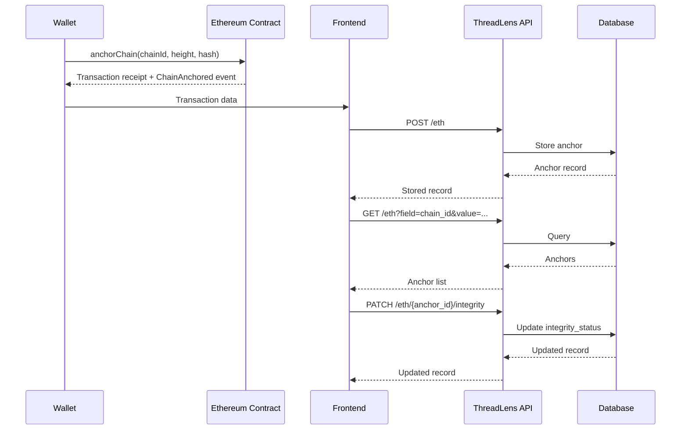

# ThreadLens Ethereum Anchor API

## Overview

The backend exposes three routes for Ethereum anchor records.

Base router:

```text
/eth
```

Routes:

```text
POST   /eth
GET    /eth
PATCH  /eth/{anchor_id}/integrity
```

---

## 1. Create Ethereum Anchor

### Endpoint

```http
POST /eth
```

### Request Body

```json
{
  "account_id": 1,
  "anchor_id": 7,
  "chain_id": "atharv_123",
  "chain_height": 1842,
  "chain_hash": "53d199b44e9bab7b021c2cc1c185c90eff583f982f287bcd7c393fe51bbebd94",
  "wallet_address": "0x1234567890123456789012345678901234567890",
  "transaction_hash": "0x123456789012345678901234567890123456789012345678901234567890abcd",
  "block_no": 9123456
}
```

### Fields

| Field | Type | Required | Description |
|---|---|---:|---|
| `account_id` | integer | Yes | ThreadLens account ID |
| `anchor_id` | integer | Yes | ID generated by the Ethereum contract |
| `chain_id` | string | Yes | ThreadLens chain identifier |
| `chain_height` | integer | Yes | Anchored ThreadLens chain height |
| `chain_hash` | string | Yes | SHA-256 hash anchored on Ethereum |
| `wallet_address` | string | Yes | Ethereum wallet that submitted the transaction |
| `transaction_hash` | string | Yes | Ethereum transaction hash |
| `block_no` | integer | Yes | Ethereum block number containing the transaction |

### Frontend fetch

```javascript
const response = await fetch("/eth", {
  method: "POST",
  headers: {
    "Content-Type": "application/json"
  },
  body: JSON.stringify({
    account_id: 1,
    anchor_id: 7,
    chain_id: "atharv_123",
    chain_height: 1842,
    chain_hash:
      "53d199b44e9bab7b021c2cc1c185c90eff583f982f287bcd7c393fe51bbebd94",
    wallet_address:
      "0x1234567890123456789012345678901234567890",
    transaction_hash:
      "0x123456789012345678901234567890123456789012345678901234567890abcd",
    block_no: 9123456
  })
});

const data = await response.json();
```

---

## 2. Get Ethereum Anchors

### Endpoint

```http
GET /eth
```

The query supports exactly three fields:

```text
account_id
anchor_id
chain_id
```

### Query Parameters

| Parameter | Type | Required | Description |
|---|---|---:|---|
| `field` | string | Yes | Field to search |
| `value` | integer/string | Yes | Value to search for |

### By account

```http
GET /eth?field=account_id&value=1
```

### By Ethereum anchor ID

```http
GET /eth?field=anchor_id&value=7
```

### By ThreadLens chain ID

```http
GET /eth?field=chain_id&value=atharv_123
```

Results are ordered by backend `id` descending, newest first.

### Frontend fetch

```javascript
const response = await fetch(
  "/eth?field=chain_id&value=atharv_123"
);

const data = await response.json();
```

### Example response

```json
[
  {
    "id": 10,
    "account_id": 1,
    "anchor_id": 18,
    "chain_id": "atharv_123",
    "chain_height": 5000,
    "chain_hash": "aaaaaaaaaaaaaaaaaaaaaaaaaaaaaaaaaaaaaaaaaaaaaaaaaaaaaaaaaaaaaaaa",
    "wallet_address": "0x1234567890123456789012345678901234567890",
    "transaction_hash": "0xbbbbbbbbbbbbbbbbbbbbbbbbbbbbbbbbbbbbbbbbbbbbbbbbbbbbbbbbbbbbbbbb",
    "block_no": 9200000,
    "integrity_status": "verified",
    "created_at": "2026-09-03T07:00:00Z",
    "updated_at": "2026-09-03T07:00:00Z"
  }
]
```

---

## 3. Update Integrity Status

### Endpoint

```http
PATCH /eth/{anchor_id}/integrity
```

The path parameter is the **Ethereum contract `anchor_id`**, not the local database `id`.

### Path Parameter

| Parameter | Type | Required | Description |
|---|---|---:|---|
| `anchor_id` | integer | Yes | Ethereum contract anchor ID |

### Request Body

```json
{
  "integrity_status": "verified"
}
```

Example statuses:

```text
verified
mismatch
invalid
```

### Frontend fetch

```javascript
const response = await fetch(
  "/eth/7/integrity",
  {
    method: "PATCH",
    headers: {
      "Content-Type": "application/json"
    },
    body: JSON.stringify({
      integrity_status: "verified"
    })
  }
);

const data = await response.json();
```

---

# Complete Flow

```mermaid
flowchart TD
    A[ThreadLens Ethereum Transaction] --> B[POST /eth]
    B --> C[(ethereum_anchors)]

    C --> D[GET /eth]
    D --> E[Query by account_id]
    D --> F[Query by anchor_id]
    D --> G[Query by chain_id]

    C --> H[Integrity Verification]
    H --> I[PATCH /eth/{anchor_id}/integrity]
    I --> C
```

# Ethereum Anchor Data Flow



# Identifier Reference

There are four important identifiers:

| Identifier | Meaning |
|---|---|
| `id` | Backend database auto-increment ID |
| `account_id` | ThreadLens account ID |
| `anchor_id` | Ethereum contract anchor ID |
| `chain_height` | ThreadLens internal blockchain height |

Also:

```text
chain_height != block_no
```

`chain_height` belongs to the ThreadLens internal chain.

`block_no` is the Ethereum block number.

---

# Endpoint Summary

| Method | Endpoint | Purpose |
|---|---|---|
| `POST` | `/eth` | Store an Ethereum anchor |
| `GET` | `/eth` | Query stored anchors |
| `PATCH` | `/eth/{anchor_id}/integrity` | Update integrity status |

## GET Examples

```text
GET /eth?field=account_id&value=1
GET /eth?field=anchor_id&value=7
GET /eth?field=chain_id&value=atharv_123
```

The backend is responsible for persistence and querying. The frontend is responsible for interacting with the deployed Ethereum contract, obtaining the transaction/event information, and then sending the resulting anchor metadata to the backend.
