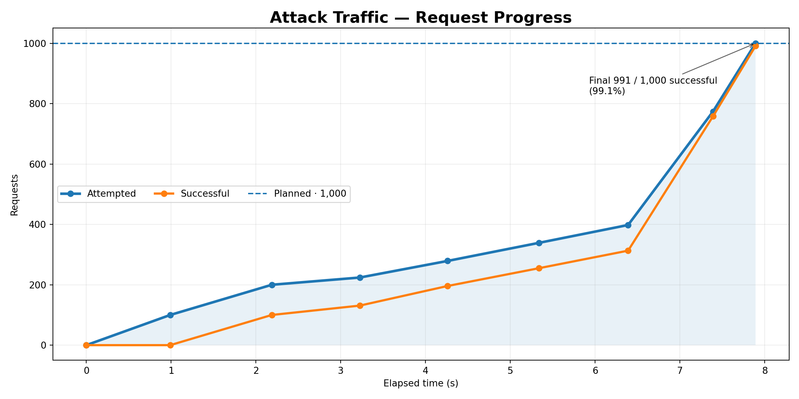
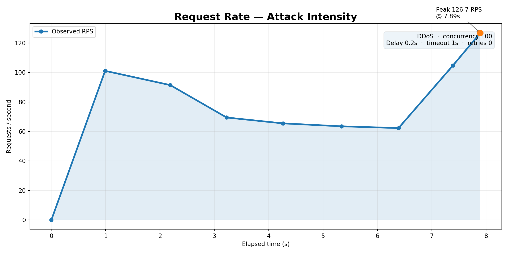
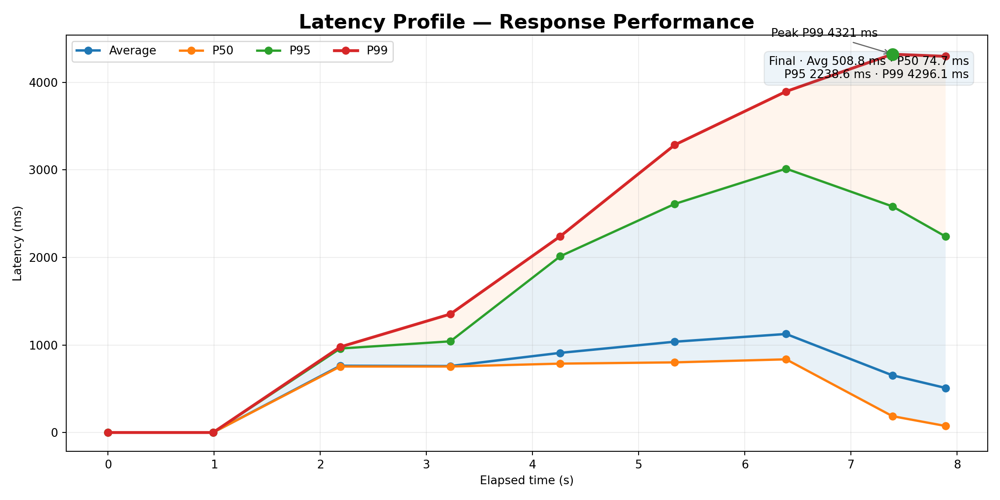
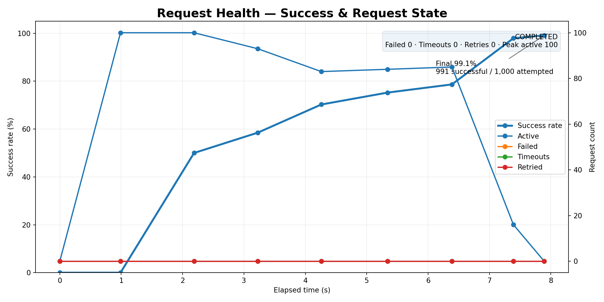

# ThreadLens Attack Graph Visualization Guide

## 1. Purpose

This document defines the **standard frontend visualization
specification** for attack records returned by:

``` http
GET /attack
```

The response is a JSON array:

``` text
List[Dict]
```

Each top-level dictionary represents **one attack execution**.

For every attack object, the frontend should render **4 graphs** using
the `plot.timeline` data and enrich those graphs with metadata from the
same attack object.

The four standard graphs are:

1.  **Attack Traffic --- Request Progress**
2.  **Request Rate --- Attack Intensity**
3.  **Latency Profile --- Response Performance**
4.  **Request Health --- Success & Request State**

The graphs should be interactive, responsive, readable, and useful for
both running and completed attacks.

------------------------------------------------------------------------

# 2. GET /attack

## Endpoint

``` http
GET /attack
```

### Query parameters

  Parameter       Type        Required Description
  --------------- --------- ---------- -------------------------------------------
  `attack_type`   string            No Filter attacks by attack type
  `page`          integer           No Page number. Default: `1`
  `limit`         integer           No Number of records per page. Default: `10`

Examples:

``` http
GET /attack?page=1&limit=10
```

``` http
GET /attack?attack_type=ddos&page=1&limit=10
```

Authentication is required. The frontend should send the user's bearer
token in the `Authorization` header.

``` http
Authorization: Bearer <token>
```

------------------------------------------------------------------------

# 3. Response Structure

The response is a direct array.

``` json
[
  {
    "id": 2,
    "account_id": 1,
    "attack_id": "1f6ab186-5d71-487c-9205-5b6fb2b472a3",
    "attack_type": "ddos",
    "request": {
      "target": {
        "base_url": "http://localhost:8000",
        "endpoint": "/tc-auth/config/pulse",
        "method": "GET",
        "path_params": null,
        "query_params": null
      },
      "request": {
        "headers": null,
        "auth": null,
        "body": null
      },
      "attack": {
        "duration": 30,
        "requests": 1000,
        "concurrency": 100,
        "delay": 0.2,
        "timeout": 1,
        "retries": 0,
        "on_failure": "continue"
      }
    },
    "status": {},
    "plot": {
      "timeline": []
    },
    "created_at": "2026-09-01T21:02:54.782893"
  }
]
```

## Important rule

Do **not** assume that the response contains only one attack.

For example:

``` javascript
const attacks = await response.json();

attacks.forEach((attack) => {
    renderAttackGraphs(attack);
});
```

Each:

``` javascript
attack
```

is the complete data source for one set of four graphs.

------------------------------------------------------------------------

# 4. Attack Object Structure

The important frontend paths are:

``` text
attack.id
attack.account_id
attack.attack_id
attack.attack_type
attack.created_at

attack.request.target
attack.request.request
attack.request.attack

attack.status
attack.status.progress
attack.status.requests
attack.status.performance
attack.status.status_codes
attack.status.errors
attack.status.error_message

attack.plot.timeline
```

The most important graph source is:

``` text
attack.plot.timeline
```

The metadata surrounding the timeline should be used to make the
visualization more informative.

------------------------------------------------------------------------

# 5. Timeline Structure

Every timeline entry has this structure:

``` json
{
  "time": 2.18727707862854,
  "attempted": 200,
  "active": 100,
  "successful": 100,
  "failed": 0,
  "timeouts": 0,
  "retried": 0,
  "rps": 91.4378895815995,
  "latency": {
    "average": 762.2376659978181,
    "p50": 753.807200002484,
    "p95": 959.3769999919459,
    "p99": 977.3362000705674
  }
}
```

### Timeline fields

  -----------------------------------------------------------------------
  Field                   Meaning                 Graph usage
  ----------------------- ----------------------- -----------------------
  `time`                  Seconds elapsed since   X-axis
                          attack started          

  `attempted`             Total requests          Traffic
                          attempted by this point 

  `active`                Requests currently      Request health
                          active                  

  `successful`            Successful requests     Traffic / health
                          accumulated by this     
                          point                   

  `failed`                Failed requests         Health
                          accumulated/by current  
                          snapshot                

  `timeouts`              Timeout count           Health

  `retried`               Retry count             Health

  `rps`                   Requests per second at  Request-rate graph
                          this point              

  `latency.average`       Average latency         Latency

  `latency.p50`           50th percentile latency Latency

  `latency.p95`           95th percentile latency Latency

  `latency.p99`           99th percentile latency Latency
  -----------------------------------------------------------------------

------------------------------------------------------------------------

# 6. Graph 1 --- Attack Traffic: Request Progress

## Purpose

Show how the attack progresses over time.

This graph should primarily compare:

-   Attempted requests
-   Successful requests
-   Planned requests

### Data extraction

``` javascript
const timeline = attack.plot?.timeline ?? [];

const time = timeline.map(point => point.time);
const attempted = timeline.map(point => point.attempted);
const successful = timeline.map(point => point.successful);
```

The planned request count comes from:

``` javascript
const plannedRequests =
    attack.request?.attack?.requests ??
    attack.status?.progress?.planned_requests ??
    0;
```

### Recommended visualization

Use:

-   smooth or straight line
-   circular data points
-   subtle area fill under attempted requests
-   dashed horizontal line for planned requests
-   tooltip on hover
-   final-value marker
-   percentage completion information

### Example

``` text
Requests
1000 |                         ● Attempted
     |                    ╱─────
     |              ╱─────
 750 |         ╱────● Successful
     |      ╱──
 500 |   ╱──
     | ╱
   0 |●──────────────────────────── Time
       0    2    4    6    8 sec
```

### Useful tooltip

At each timeline point:

``` text
Time: 6.39 s

Attempted: 398
Successful: 313
Active: 85
Failed: 0
Timeouts: 0
Retries: 0
Completion: 39.8%
```

### Additional metadata

Display near the graph:

``` text
Attack: DDoS
Planned: 1,000 requests
Concurrency: 100
Duration: 30 s
```

### Derived metric

Completion percentage:

``` javascript
const completionRate =
    plannedRequests > 0
        ? (attempted / plannedRequests) * 100
        : 0;
```

Do not confuse **completion percentage** with **success rate**.

------------------------------------------------------------------------

# 7. Graph 2 --- Request Rate: Attack Intensity

## Purpose

Show how aggressively requests are being generated throughout the
attack.

Primary data:

``` javascript
const rps = timeline.map(point => point.rps);
```

### X-axis

``` text
time
```

### Y-axis

``` text
requests / second
```

### Recommended visualization

Use:

-   line graph
-   area fill
-   highlighted maximum RPS
-   highlighted final RPS
-   hover tooltip
-   attack configuration shown alongside the graph

### Peak RPS

``` javascript
const peakPoint = timeline.reduce(
    (max, point) => point.rps > max.rps ? point : max,
    timeline[0]
);
```

Display:

``` text
Peak RPS: 126.72
Peak time: 7.89 s
```

### Configuration metadata

Extract:

``` javascript
const attackConfig = attack.request?.attack ?? {};

const concurrency = attackConfig.concurrency;
const delay = attackConfig.delay;
const timeout = attackConfig.timeout;
const retries = attackConfig.retries;
```

A useful graph header could show:

``` text
DDoS
Concurrency: 100
Delay: 0.2 s
Timeout: 1 s
Retries: 0
```

This gives the user context for why the RPS curve looks the way it does.

------------------------------------------------------------------------

# 8. Graph 3 --- Latency Profile

## Purpose

This is the most important graph for understanding target response
performance.

It should show all four latency series:

-   Average
-   P50
-   P95
-   P99

### Data extraction

``` javascript
const average = timeline.map(
    point => point.latency?.average ?? null
);

const p50 = timeline.map(
    point => point.latency?.p50 ?? null
);

const p95 = timeline.map(
    point => point.latency?.p95 ?? null
);

const p99 = timeline.map(
    point => point.latency?.p99 ?? null
);
```

### Recommended visualization

Use four lines:

``` text
Average
P50
P95
P99
```

Also use percentile bands where supported:

``` text
P50 ─────────────
       shaded region
P95 ─────────────
       shaded tail
P99 ─────────────
```

This makes latency degradation much easier to see.

### Important

Latency is measured in milliseconds.

Therefore:

``` text
Y-axis = Latency (ms)
```

Do not convert it to seconds unless the UI specifically requires it.

### Peak P99

``` javascript
const peakP99Point = timeline.reduce(
    (max, point) =>
        (point.latency?.p99 ?? 0) >
        (max.latency?.p99 ?? 0)
            ? point
            : max,
    timeline[0]
);
```

Display:

``` text
Peak P99: 4,320.8 ms
at 7.39 s
```

### Final latency summary

Use the final timeline point or the aggregate status performance:

``` javascript
const finalPoint = timeline[timeline.length - 1];

const finalLatency = finalPoint?.latency;
```

Display:

``` text
Average: 508.8 ms
P50: 74.7 ms
P95: 2238.6 ms
P99: 4296.1 ms
```

The aggregate values from:

``` text
attack.status.performance
```

can also be shown as a compact final summary.

------------------------------------------------------------------------

# 9. Graph 4 --- Request Health: Success & Request State

## Purpose

Combine request success with the state of active/problematic requests.

This graph should communicate:

-   success rate
-   active requests
-   failures
-   timeouts
-   retries

### Success rate

The timeline provides cumulative attempted and successful counts.

Calculate:

``` javascript
const successRate = timeline.map(point => {
    if (!point.attempted) return 0;

    return (point.successful / point.attempted) * 100;
});
```

### State series

``` javascript
const active = timeline.map(point => point.active);
const failed = timeline.map(point => point.failed);
const timeouts = timeline.map(point => point.timeouts);
const retried = timeline.map(point => point.retried);
```

### Recommended design

Use a dual-axis graph:

**Left axis**

``` text
Success rate (%)
```

**Right axis**

``` text
Request count
```

This prevents the success percentage from being visually overwhelmed by
request counts.

### Example

``` text
Success %
100 |──────────────────────●
 90 |                 ╱────
 80 |             ╱──
    |
    +----------------------------

       Active
       Failed
       Timeout
       Retried
```

### Tooltip

``` text
Time: 6.39 s

Success rate: 78.64%

Successful: 313
Attempted: 398
Active: 85
Failed: 0
Timeouts: 0
Retries: 0
```

------------------------------------------------------------------------

# 10. Metadata That Should Enrich the Graphs

The timeline alone is not enough for a high-quality visualization.

Use the surrounding attack object.

## Attack identity

``` javascript
attack.id
attack.attack_id
attack.attack_type
attack.created_at
```

Display:

``` text
DDoS
Attack ID: 1f6ab186-...
Created: 01 Sep 2026, 21:02:54
```

The UUID should be truncated visually but available in the tooltip/copy
action.

Example:

``` text
1f6ab186-5d71-487c-9205-5b6fb2b472a3
```

------------------------------------------------------------------------

# 11. Target Metadata

Extract:

``` javascript
const target = attack.request?.target ?? {};
```

Available fields:

``` text
base_url
endpoint
method
path_params
query_params
```

Example:

``` javascript
const targetLabel = `${target.method ?? "?"} ${target.endpoint ?? ""}`;
```

Display:

``` text
GET /tc-auth/config/pulse
```

If useful, show:

``` text
Base URL: http://localhost:8000
Method: GET
Endpoint: /tc-auth/config/pulse
```

Do not expose sensitive request headers/auth data unnecessarily in
visualization tooltips.

------------------------------------------------------------------------

# 12. Attack Configuration Metadata

Extract:

``` javascript
const config = attack.request?.attack ?? {};
```

Fields:

``` text
duration
requests
concurrency
delay
timeout
retries
on_failure
```

Example UI:

``` text
Attack Configuration

Duration       30 s
Requests       1,000
Concurrency   100
Delay          0.2 s
Timeout        1 s
Retries        0
On failure     continue
```

This information makes the graphs much easier to interpret.

------------------------------------------------------------------------

# 13. Final Status Metadata

Extract:

``` javascript
const status = attack.status ?? {};
```

Important fields:

``` text
status.status
status.elapsed_seconds

status.progress.planned_requests
status.progress.attempted_requests
status.progress.active_requests

status.requests.successful
status.requests.failed
status.requests.timeouts
status.requests.retried

status.performance.requests_per_second
status.performance.average_latency_ms
status.performance.p50_latency_ms
status.performance.p95_latency_ms
status.performance.p99_latency_ms

status.status_codes
status.errors
status.error_message
```

------------------------------------------------------------------------

# 14. Final Summary Cards

Above or beside the graphs, show a compact summary.

Recommended cards:

``` text
STATUS
COMPLETED

REQUESTS
991 / 1,000 successful

SUCCESS RATE
99.1%

RPS
126.72

AVG LATENCY
508.8 ms

P99 LATENCY
4.30 s

ELAPSED
7.89 s
```

These cards should use `attack.status` because it represents the
aggregate/final execution state.

------------------------------------------------------------------------

# 15. Status Codes

The response contains:

``` javascript
attack.status?.status_codes
```

Example:

``` json
{
  "200": 991
}
```

This data should **not replace the four standard timeline graphs**.

Instead, use it as additional information.

Recommended UI:

``` text
HTTP Status Codes

200    991
```

For multiple status codes:

``` json
{
  "200": 950,
  "404": 30,
  "500": 20
}
```

Display a compact status-code breakdown.

A small donut/bar visualization can be added to the attack detail page
if desired, but it is **not part of the four standard graphs**.

------------------------------------------------------------------------

# 16. Errors and Findings

The attack object may contain:

``` javascript
attack.status?.errors
attack.status?.error_message
```

If errors exist, show them separately from the normal graphs.

Example:

``` text
Errors
500 responses: 20
Connection reset: 4
```

Do not silently discard error information.

If the backend later provides `findings`, they can be shown as an
attack-analysis section alongside the graphs.

------------------------------------------------------------------------

# 17. Running vs Completed Attacks

The same graph implementation should work for:

``` text
running
completed
failed
```

or any other backend status.

Check:

``` javascript
const executionStatus = attack.status?.status;
```

## Running

When:

``` text
status === "running"
```

the frontend should:

-   render all currently available timeline points
-   show current elapsed time
-   show active requests
-   avoid treating the last point as the final result
-   optionally show a `LIVE` indicator
-   update the graph when fresh attack data arrives

Example:

``` text
● LIVE

Elapsed: 6.39 s
Attempted: 398
Active: 85
```

## Completed

When:

``` text
status === "completed"
```

the frontend can show:

``` text
✓ COMPLETED
```

and use the final timeline point as the final graph marker.

------------------------------------------------------------------------

# 18. Missing or Zero Latency

The first timeline entries can legitimately contain:

``` json
"latency": {
  "average": 0,
  "p50": 0,
  "p95": 0,
  "p99": 0
}
```

because no completed requests may exist yet.

Do not interpret this as an actual 0 ms server response.

Prefer treating the latency value as unavailable when there are no
completed requests.

For example:

``` javascript
const hasLatency =
    point.successful > 0 ||
    point.failed > 0 ||
    point.timeouts > 0;
```

Then:

``` javascript
const latency = hasLatency
    ? point.latency?.average
    : null;
```

For libraries that support gaps, `null` is preferable to drawing a false
zero-latency line.

------------------------------------------------------------------------

# 19. Null-Safe Extraction

Frontend code should never assume every optional field exists.

Recommended:

``` javascript
const timeline = attack.plot?.timeline ?? [];

const target = attack.request?.target ?? {};
const config = attack.request?.attack ?? {};
const status = attack.status ?? {};
const progress = status.progress ?? {};
const requests = status.requests ?? {};
const performance = status.performance ?? {};
```

For timeline:

``` javascript
const points = timeline.map(point => ({
    time: point.time ?? 0,
    attempted: point.attempted ?? 0,
    active: point.active ?? 0,
    successful: point.successful ?? 0,
    failed: point.failed ?? 0,
    timeouts: point.timeouts ?? 0,
    retried: point.retried ?? 0,
    rps: point.rps ?? 0,

    average: point.latency?.average ?? null,
    p50: point.latency?.p50 ?? null,
    p95: point.latency?.p95 ?? null,
    p99: point.latency?.p99 ?? null
}));
```

------------------------------------------------------------------------

# 20. Recommended Frontend Normalization

A useful normalized representation is:

``` javascript
function normalizeAttackForGraphs(attack) {
    const timeline = attack.plot?.timeline ?? [];
    const config = attack.request?.attack ?? {};
    const target = attack.request?.target ?? {};
    const status = attack.status ?? {};
    const performance = status.performance ?? {};

    return {
        identity: {
            id: attack.id,
            attackId: attack.attack_id,
            type: attack.attack_type,
            createdAt: attack.created_at
        },

        target: {
            baseUrl: target.base_url,
            endpoint: target.endpoint,
            method: target.method
        },

        config: {
            duration: config.duration,
            plannedRequests:
                config.requests ??
                status.progress?.planned_requests ??
                0,
            concurrency: config.concurrency,
            delay: config.delay,
            timeout: config.timeout,
            retries: config.retries,
            onFailure: config.on_failure
        },

        execution: {
            status: status.status,
            elapsedSeconds: status.elapsed_seconds,
            attempted:
                status.progress?.attempted_requests ?? 0,
            active:
                status.progress?.active_requests ?? 0
        },

        final: {
            successful: status.requests?.successful ?? 0,
            failed: status.requests?.failed ?? 0,
            timeouts: status.requests?.timeouts ?? 0,
            retried: status.requests?.retried ?? 0,
            rps: performance.requests_per_second ?? 0,
            averageLatency:
                performance.average_latency_ms ?? null,
            p50: performance.p50_latency_ms ?? null,
            p95: performance.p95_latency_ms ?? null,
            p99: performance.p99_latency_ms ?? null,
            statusCodes: status.status_codes ?? {},
            errors: status.errors ?? {}
        },

        timeline: timeline.map(point => ({
            time: point.time ?? 0,
            attempted: point.attempted ?? 0,
            active: point.active ?? 0,
            successful: point.successful ?? 0,
            failed: point.failed ?? 0,
            timeouts: point.timeouts ?? 0,
            retried: point.retried ?? 0,
            rps: point.rps ?? 0,
            average: point.latency?.average ?? null,
            p50: point.latency?.p50 ?? null,
            p95: point.latency?.p95 ?? null,
            p99: point.latency?.p99 ?? null
        }))
    };
}
```

The chart components should consume this normalized structure rather
than repeatedly traversing the raw API object.

------------------------------------------------------------------------

# 21. Building Chart Datasets

Example:

``` javascript
const graphData = normalizeAttackForGraphs(attack);

const trafficData = graphData.timeline.map(point => ({
    x: point.time,
    attempted: point.attempted,
    successful: point.successful
}));

const rpsData = graphData.timeline.map(point => ({
    x: point.time,
    rps: point.rps
}));

const latencyData = graphData.timeline.map(point => ({
    x: point.time,
    average: point.average,
    p50: point.p50,
    p95: point.p95,
    p99: point.p99
}));

const healthData = graphData.timeline.map(point => ({
    x: point.time,
    successRate:
        point.attempted > 0
            ? (point.successful / point.attempted) * 100
            : 0,
    active: point.active,
    failed: point.failed,
    timeouts: point.timeouts,
    retried: point.retried
}));
```

------------------------------------------------------------------------

# 22. Interaction Requirements

The graphs should not be static images in the actual frontend.

Recommended interactions:

### Hover

Show a detailed tooltip for the exact timeline point.

### Crosshair

A vertical crosshair makes it easier to compare:

``` text
RPS
Active requests
Success rate
Latency percentiles
```

at the same timestamp.

### Zoom

For long attacks, allow:

-   drag-to-zoom
-   wheel zoom
-   reset zoom

### Legend

Users should be able to toggle individual series.

For example, on the latency graph:

``` text
☑ Average
☑ P50
☑ P95
☑ P99
```

### Responsive layout

The four graphs should work on:

-   desktop
-   laptop
-   tablet
-   mobile

Avoid fixed-width charts.

------------------------------------------------------------------------

# 23. Formatting Rules

## Time

Prefer:

``` text
0.00 s
1.25 s
7.89 s
```

For longer attacks:

``` text
1m 24s
```

## Requests

Use thousands separators:

``` text
1,000
10,000
100,000
```

## RPS

Prefer 1--2 decimal places:

``` text
126.72 RPS
```

## Latency

Use milliseconds below one second:

``` text
508.8 ms
```

For large values, optionally display both:

``` text
4,296.1 ms
(4.30 s)
```

## Percentages

Use:

``` text
99.1%
```

rather than excessive decimal precision.

------------------------------------------------------------------------

# 24. Example: Complete Graph Metadata

For the sample attack:

``` text
Attack type       DDoS
Attack ID         1f6ab186-5d71-487c-9205-5b6fb2b472a3
Status            COMPLETED
Target            GET /tc-auth/config/pulse

Planned           1,000 requests
Attempted         1,000
Successful        991
Failed            0
Timeouts          0
Retries           0

Concurrency       100
Delay             0.2 s
Timeout           1 s
Configured        30 s

Elapsed           7.89 s
Final RPS         126.72
Success rate      99.1%

Average latency   508.8 ms
P50               74.7 ms
P95               2,238.6 ms
P99               4,296.1 ms
```

This information should be available around the four graphs.

------------------------------------------------------------------------

# 25. The Four Standard Graphs

Every attack detail view should render:

## Graph 1

``` text
Attack Traffic — Request Progress

Attempted
Successful
Planned
```

Source:

``` text
plot.timeline[].time
plot.timeline[].attempted
plot.timeline[].successful
request.attack.requests
status.progress.planned_requests
```

------------------------------------------------------------------------

## Graph 2

``` text
Request Rate — Attack Intensity

RPS
```

Source:

``` text
plot.timeline[].time
plot.timeline[].rps
```

Context:

``` text
request.attack.concurrency
request.attack.delay
request.attack.timeout
request.attack.retries
```

------------------------------------------------------------------------

## Graph 3

``` text
Latency Profile — Response Performance

Average
P50
P95
P99
```

Source:

``` text
plot.timeline[].time
plot.timeline[].latency.average
plot.timeline[].latency.p50
plot.timeline[].latency.p95
plot.timeline[].latency.p99
```

------------------------------------------------------------------------

## Graph 4

``` text
Request Health — Success & Request State

Success rate
Active
Failed
Timeouts
Retries
```

Source:

``` text
plot.timeline[].time
plot.timeline[].attempted
plot.timeline[].successful
plot.timeline[].active
plot.timeline[].failed
plot.timeline[].timeouts
plot.timeline[].retried
```

------------------------------------------------------------------------

# 26. Example Graph Images

The repository contains example renders of the four standard graphs.

### 01 --- Attack Traffic



[Open `01_attack_traffic.png` on
GitHub](https://github.com/dev47929/ThreatLens/blob/main/backend/SITE_MODULE/docs/graphs/01_attack_traffic.png)

------------------------------------------------------------------------

### 02 --- Request Rate



[Open `02_request_rate.png` on
GitHub](https://github.com/dev47929/ThreatLens/blob/main/backend/SITE_MODULE/docs/graphs/02_request_rate.png)

------------------------------------------------------------------------

### 03 --- Latency Profile



[Open `03_latency_profile.png` on
GitHub](https://github.com/dev47929/ThreatLens/blob/main/backend/SITE_MODULE/docs/graphs/03_latency_profile.png)

------------------------------------------------------------------------

### 04 --- Request Health



[Open `04_request_health.png` on
GitHub](https://github.com/dev47929/ThreatLens/blob/main/backend/SITE_MODULE/docs/graphs/04_request_health.png)

------------------------------------------------------------------------

# 27. Full Sample Timeline Transformation

Given:

``` json
{
  "time": 6.388582468032837,
  "attempted": 398,
  "active": 85,
  "successful": 313,
  "failed": 0,
  "timeouts": 0,
  "retried": 0,
  "rps": 62.29864011171661,
  "latency": {
    "average": 1125.2933207649392,
    "p50": 835.7655999716371,
    "p95": 3013.488099910319,
    "p99": 3895.27870004531
  }
}
```

the frontend can transform it into:

``` json
{
  "x": 6.3886,
  "traffic": {
    "attempted": 398,
    "successful": 313
  },
  "rate": {
    "rps": 62.30
  },
  "latency": {
    "average": 1125.29,
    "p50": 835.77,
    "p95": 3013.49,
    "p99": 3895.28
  },
  "health": {
    "success_rate": 78.64,
    "active": 85,
    "failed": 0,
    "timeouts": 0,
    "retried": 0
  }
}
```

This normalized point can be used by any chart library.

------------------------------------------------------------------------

# 28. Do Not Make These Mistakes

### Do not use only `status.performance`

`status.performance` gives aggregate/final metrics.

The actual graph curves should come from:

``` text
plot.timeline
```

------------------------------------------------------------------------

### Do not use `status.requests.successful` as every timeline point

This:

``` javascript
status.requests.successful
```

is the final/aggregate value.

For the curve use:

``` javascript
point.successful
```

------------------------------------------------------------------------

### Do not use planned requests as the attempted curve

These are different:

``` text
planned_requests
attempted_requests
```

Planned requests are the target.

Attempted requests are actual execution progress.

------------------------------------------------------------------------

### Do not treat `active` as cumulative

`active` represents currently active requests at the snapshot.

It can rise and fall.

------------------------------------------------------------------------

### Do not interpret zero initial latency as real 0 ms latency

Early points may contain no completed requests.

Represent unavailable latency as a gap where appropriate.

------------------------------------------------------------------------

### Do not create one graph for all attacks

The standard is:

``` text
ONE ATTACK
    │
    ├── Graph 1: Traffic
    ├── Graph 2: RPS
    ├── Graph 3: Latency
    └── Graph 4: Health
```

If the API returns:

``` text
10 attacks
```

the frontend has ten attack records, and each attack can have its own
four-graph detail view.

------------------------------------------------------------------------

# 29. Recommended Attack Detail Layout

A good attack detail page can follow:

``` text
┌─────────────────────────────────────────────────────────────┐
│ DDoS                              COMPLETED                  │
│ Attack ID: 1f6ab186-...                                     │
│ GET /tc-auth/config/pulse                                   │
├───────────┬───────────┬───────────┬───────────┬─────────────┤
│ Requests  │ Success   │ RPS       │ Avg Lat.  │ P99         │
│ 1,000     │ 99.1%     │ 126.72    │ 508.8 ms  │ 4.30 s      │
├─────────────────────────────────────────────────────────────┤
│                                                             │
│       Graph 1 — Attack Traffic                              │
│                                                             │
├─────────────────────────────────────────────────────────────┤
│                                                             │
│       Graph 2 — Request Rate                                │
│                                                             │
├─────────────────────────────────────────────────────────────┤
│                                                             │
│       Graph 3 — Latency Profile                             │
│                                                             │
├─────────────────────────────────────────────────────────────┤
│                                                             │
│       Graph 4 — Request Health                              │
│                                                             │
├─────────────────────────────────────────────────────────────┤
│ Attack Configuration | Status Codes | Errors                │
└─────────────────────────────────────────────────────────────┘
```

For desktop layouts, graphs 1/2 and 3/4 may also be displayed as a
two-column grid.

------------------------------------------------------------------------

# 30. Final Implementation Rule

The frontend should treat the API response as the source of truth.

For each attack:

``` javascript
const timeline = attack.plot?.timeline ?? [];
```

Use:

``` text
plot.timeline
```

for time-series visualization.

Use:

``` text
status
```

for aggregate/final execution information.

Use:

``` text
request.attack
```

for configured attack parameters.

Use:

``` text
request.target
```

for target/method/endpoint context.

Use:

``` text
attack_type
attack_id
created_at
```

for identity and presentation.

The resulting visualization should be **data-driven**: no graph should
contain hard-coded attack values, labels, request counts, latency
values, or status values.

The same four graph components must work with any attack object that
follows this API structure.
