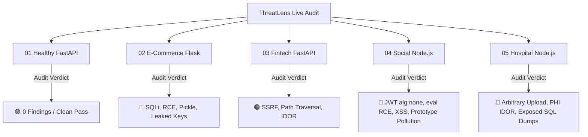

# 🎯 ThreatLens Live Judge Demo Backends Suite

This directory contains **5 isolated, production-like backend services** crafted specifically for demonstrating the offensive auditing, vulnerability detection, and dynamic probing capabilities of **ThreatLens / ThreatLensGo** during live judge evaluations.

---

## 📊 Microservices Matrix

| # | Folder Name | Language & Stack | Port | Status | Primary Vulnerability / Security Profile |
|---|---|---|---|---|---|
| **01** | [`01_healthy_secure_api`](./01_healthy_secure_api/) | **Python** (FastAPI) | `8001` | 🟢 **100% HEALTHY** | **Golden Reference Baseline**: Parameterized queries, cryptographic HS256 JWT, sliding-window rate limiting, full CSP/HSTS headers, path traversal defense. |
| **02** | [`02_vulnerable_ecommerce_py`](./02_vulnerable_ecommerce_py/) | **Python** (Flask) | `8002` | 🔴 **CRITICAL** | **E-Commerce API**: SQL Injection, OS Command Injection (RCE), Pickle Insecure Deserialization, Leaked AWS & Stripe Keys, Exposed `/.env` & `/debug`. |
| **03** | [`03_vulnerable_fintech_py`](./03_vulnerable_fintech_py/) | **Python** (FastAPI) | `8003` | 🟠 **HIGH** | **Fintech Wallet**: Server-Side Request Forgery (SSRF), Path Traversal (LFI), IDOR on Bank Accounts, Missing Rate Limiting on PIN authentication. |
| **04** | [`04_vulnerable_social_node`](./04_vulnerable_social_node/) | **Node.js** (Express) | `8004` | 🔴 **CRITICAL** | **Social Network**: Broken JWT (`alg: none` & weak secret), Dynamic `eval()` RCE, Stored & Reflected XSS, Object Prototype Pollution. |
| **05** | [`05_vulnerable_hospital_node`](./05_vulnerable_hospital_node/) | **Node.js** (Express) | `8005` | 🔴 **CRITICAL** | **Hospital Portal**: Unrestricted Arbitrary File Upload, IDOR on Patient Health Records (PHI), Exposed `backup.sql` database dump, Insecure Cookies. |

---

## 🔬 Vulnerability Catalog & CWE / OWASP Mapping



| Vulnerability Type | CWE | OWASP Top 10 | Target Backend | Vulnerable Endpoint |
|---|---|---|---|---|
| **SQL Injection (SQLi)** | CWE-89 | A03:2021 - Injection | `02_vulnerable_ecommerce_py` | `GET /api/products/search?q=`<br>`POST /api/auth/login` |
| **OS Command Injection (RCE)** | CWE-78 | A03:2021 - Injection | `02_vulnerable_ecommerce_py` | `POST /api/tools/ping` |
| **Insecure Deserialization** | CWE-502 | A08:2021 - Integrity Failures | `02_vulnerable_ecommerce_py` | `POST /api/cart/restore-session` |
| **Hardcoded Secrets & API Keys** | CWE-798 | A07:2021 - Auth Failures | `02_vulnerable_ecommerce_py` | Leaked AWS & Stripe credentials |
| **Exposed Config & Backups** | CWE-552 | A05:2021 - Security Misconfig | `02_vulnerable_ecommerce_py`<br>`05_vulnerable_hospital_node` | `GET /.env`<br>`GET /backup.sql`<br>`GET /debug` |
| **Server-Side Request Forgery (SSRF)** | CWE-918 | A10:2021 - SSRF | `03_vulnerable_fintech_py` | `POST /api/v1/webhook/test` |
| **Path Traversal / LFI** | CWE-22 | A01:2021 - Broken Access Control | `03_vulnerable_fintech_py` | `GET /api/v1/statements/download?file=` |
| **IDOR (Access Control Bypass)** | CWE-639 | A01:2021 - Broken Access Control | `03_vulnerable_fintech_py`<br>`05_vulnerable_hospital_node` | `GET /api/v1/accounts/{id}/balance`<br>`GET /api/patients/:id/records` |
| **Broken JWT (`alg: none`)** | CWE-287 | A07:2021 - Auth Failures | `04_vulnerable_social_node` | `GET /api/auth/profile` |
| **Dynamic Code Execution (`eval`)** | CWE-95 | A03:2021 - Injection | `04_vulnerable_social_node` | `POST /api/feed/calculate-rank` |
| **Cross-Site Scripting (XSS)** | CWE-79 | A03:2021 - Injection | `04_vulnerable_social_node` | `GET /api/feed/search?q=` |
| **Prototype Pollution** | CWE-1321 | A08:2021 - Integrity Failures | `04_vulnerable_social_node` | `POST /api/user/preferences` |
| **Arbitrary File Upload** | CWE-434 | A04:2021 - Insecure Design | `05_vulnerable_hospital_node` | `POST /api/medical-records/upload` |
| **Missing Rate Limiting** | CWE-307 | A07:2021 - Auth Failures | `03_vulnerable_fintech_py`<br>`05_vulnerable_hospital_node` | `POST /api/v1/auth/pin-login`<br>`POST /api/auth/verify-otp` |

---

## ⚡ Quick Start: Running Backends for the Live Demo

### Option A: Running Python Backends
```powershell
# 1. Healthy API (Port 8001)
cd test_backends/01_healthy_secure_api
python -m uvicorn app:app --port 8001

# 2. Vulnerable E-Commerce (Port 8002)
cd test_backends/02_vulnerable_ecommerce_py
python app.py

# 3. Vulnerable Fintech (Port 8003)
cd test_backends/03_vulnerable_fintech_py
python -m uvicorn app:app --port 8003
```

### Option B: Running Node.js Backends
```powershell
# 4. Vulnerable Social Media (Port 8004)
cd test_backends/04_vulnerable_social_node
npm install
node server.js

# 5. Vulnerable Hospital Portal (Port 8005)
cd test_backends/05_vulnerable_hospital_node
npm install
node server.js
```

---

## 🎤 Live Judge Demonstration Script

1. **Baseline Validation**: Scan `http://localhost:8001` using ThreatLens / `sectest`. Show the judges that ThreatLens produces a **clean green bill of health** with zero false positives.
2. **Injection & RCE Demo**: Point ThreatLens to `http://localhost:8002`. Demonstrate real-time detection of SQLi in `/api/products/search`, OS Command Injection in `/api/tools/ping`, and exposed `.env` credentials.
3. **Advanced Web Defect Demo**: Point ThreatLens to `http://localhost:8003` and `http://localhost:8004`. Demonstrate SSRF detection, Path Traversal, and JWT `alg: none` authentication forgery.
4. **Data Exfiltration & File Upload Demo**: Scan `http://localhost:8005`. Demonstrate immediate discovery of `backup.sql` database dump and unrestricted file upload vulnerabilities.
